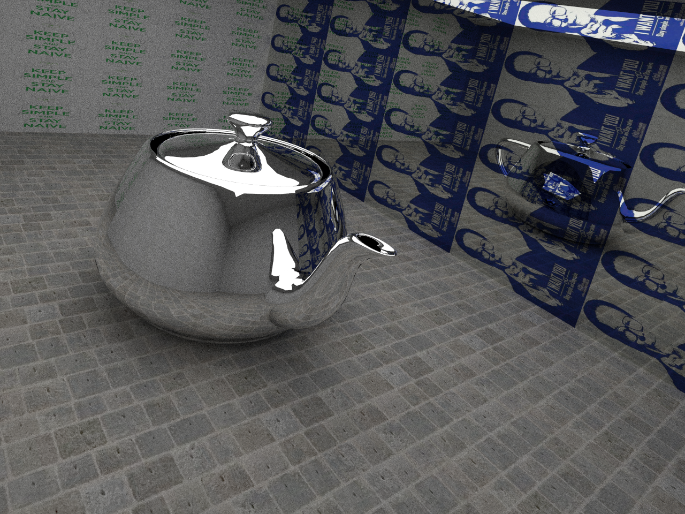
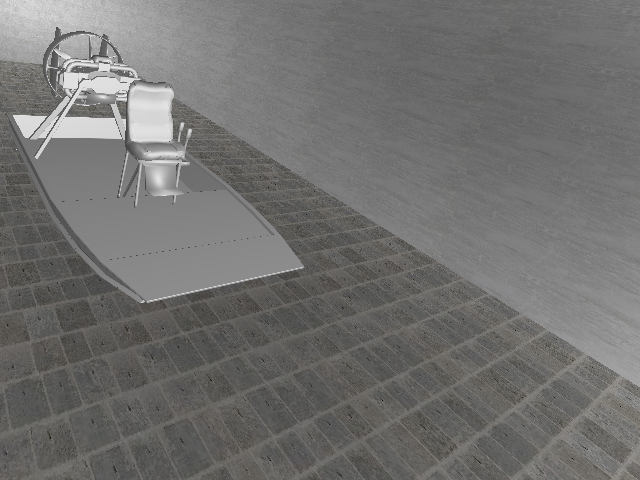
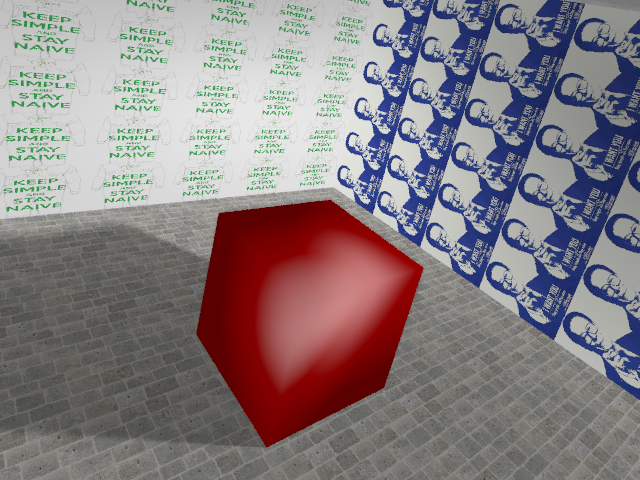
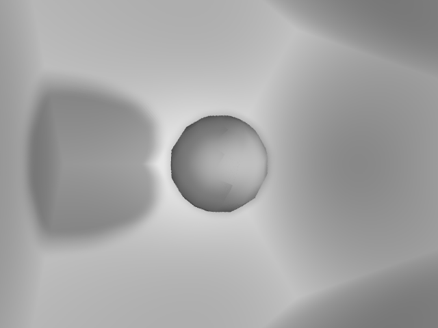

# Gallifrey
Course assignment(midterm) of CS230.

To implement <del>an efficient</del> Ray Tracing algorithm on CPU.

Default resolution is 640 x 480, if you would like to use other configurations, please refer to `src/image.h` and set the value of `height` and `width`.

If you would like to run the code on CPU with more then 4 cores, please refer to `src/main.cpp` and set the value of `num_workers`.

## Structure

    demo/           # To store some selected outputs
    out/            # Output of the program will be directed here
    resources/      # To store `.obj` models
    vendor/         # To store third-party libraries
    src/            # Source code
    | aabb.h        # To implement the Axis-Aligned Bounding Box
    | colors.h      # To implement some functions related to color of pixels.
    | geometry.h    # To implement some classes and functions related to algebra and geometry.
    | image.h       # To implement a class that contains the information of the output.
    | io.h          # To implement some functions to parse `.obj` files and dump `.bmp` files.
    | kdtree.h      # To implement the SAH-KDTree
    | shader.h      # To implement the Phong Shading algorithm.
    | tracing.h     # To implement some functions
    | main.cpp      # Set parameters

## Features

- Phong Shading
- Anti Aliasing
- Global / Local illumination
- SAH KDTree
- Multi Threading
- Monte Carlo Ray Tracing
- Texture

## Requirements

- GCC/G++(mingw) 4.8+, std-c++11
- OPENCV 2+
- ConcurrentQueue(https://github.com/cameron314/concurrentqueue.git)
- Bitmap(https://github.com/ArashPartow/bitmap.git)

## Compile & Run
This project is cross-platform (Windows, Unix/Linux). But it's not recommended to compile & run on Windows cause multi-threading is disabled, thus rendering may take a long time.

For Unix/Linux users:

    git clone https://github.com/yzh119/gallifrey.git --recurse-submodules
    cd gallifrey/
    cmake -DCMAKE_BUILD_TYPE=RELEASE .
    make && cd bin
    ./gallifrey [--model MODEL_NAME] [--core CORE] [--anti_aliasing] [--shadow] [--global] [--help]  # MODEL_NAME specifies the program will render resources/MODEL_NAME.obj, CORE specifies the number of threads.
    cd ../out

For Windows users(using Powershell, with `git`, `mingw`, 'cmake' in your `PATH` environment variable):

    git clone https://github.com/yzh119/gallifrey.git --recurse-submodules
    cd gallifrey/
    cmake -G "MinGW Makefiles" -DCMAKE_BUILD_TYPE=RELEASE .
    mingw32-make
    cd bin
    ./gallifrey [--model MODEL_NAME] [--core CORE] [--anti_aliasing] [--shadow] [--global] [--help]  # MODEL_NAME specifies the program will render resources/MODEL_NAME.obj, CORE specifies the number of threads.
    cd ../out

## Milestone
- [x] Surface Area Heuristic KD-Tree
- [x] Anti Aliasing
- [x] Phong Shader
- [x] Ray Casting (Local illumination)
- [ ] Ray Tracing (Global illumination)
- [x] Soft Shadow
- [ ] Transparent
- [ ] Color Blending
- [x] Texture
- [x] Multi-threading

## Statistics

## Demo

## Reference
- An Integrated Introduction to Computer Graphics and Geometric Modeling. Ron Goldman
- Global Illumination in 99 lines of C++: http://www.kevinbeason.com/smallpt/
- SAH kd-tree: http://dcgi.felk.cvut.cz/home/havran/ARTICLES/ingo06rtKdtree.pdf
- About how to load textures: https://learnopengl-cn.readthedocs.io/zh/latest/01%20Getting%20started/06%20Textures/
- Ray-Box Intersection: http://www.cs.utah.edu/~awilliam/box/box.pdf
- Yuxin Wu's repository: https://github.com/ppwwyyxx/Ray-Tracing-Engine
