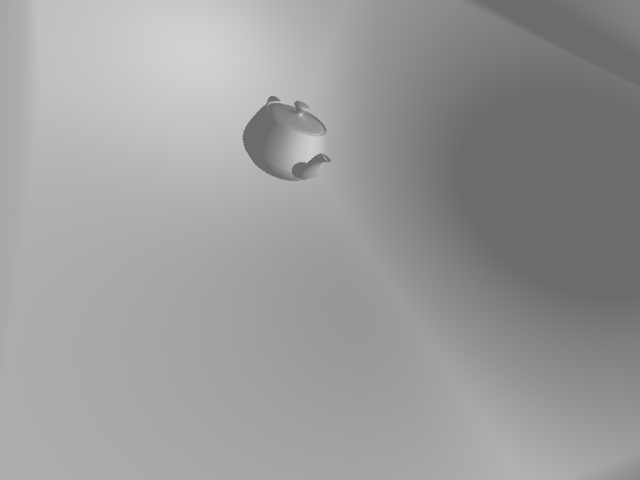

# Gallifrey
Course assignment(midterm) of CS230.

To implement <del>an efficient</del> Ray Tracing algorithm.

## Components

## Compile
It's not recommended to compile/run on windows cause multi-threading is disabled, thus rendering may take a long time.

    git clone https://github.com/yzh119/gallifrey.git --recurse-submodules
    cd gallifrey/
    cmake .
    make

## Requirements

- std-c++11
- ConcurrentQueue(https://github.com/cameron314/concurrentqueue.git)
- Bitmap(https://github.com/ArashPartow/bitmap.git)

## Milestone
- [ ] Surface Area Heuristic KD-Tree
- [x] Phong Shader
- [x] Ray Casting
- [ ] Ray Tracing
- [ ] Soft Shadow 
- [ ] Transparent
- [ ] Color Bleeding
- [ ] Texture
- [x] Multi-threading

## Demo

## Reference
- Global Illumination in 99 lines of C++: http://www.kevinbeason.com/smallpt/
- SAH kd-tree: http://dcgi.felk.cvut.cz/home/havran/ARTICLES/ingo06rtKdtree.pdf
- An Integrated Introduction to Computer Graphics and Geometric Modeling. Ron Goldman
