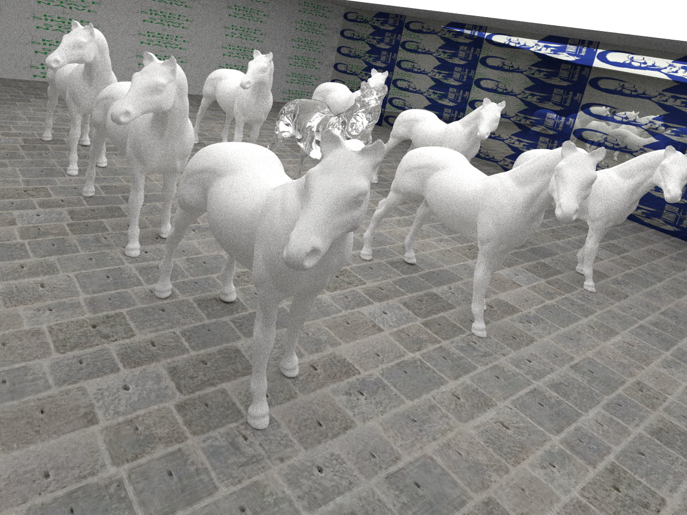

# Gallifrey
Course final project of CS230.

To implement a 3D-engine using Monte Carlo Path Tracing and state-of-the-art "Adaptive Polynomial Rendering" algorithm (SIGGRAPH 2016) on GPU.

Default resolution is 1280 x 960, if you would like to use other configurations, Please run the script `set_resolution.py`:

	python set_resolution WIDTH HEIGHT

## Structure

    demo/           # To store some selected outputs
    out/            # Output of the program will be directed here
    resources/      # To store `.obj` models
    vendor/         # To store third-party libraries
    src/            # Source code
    | aabb.h        # To implement the Axis-Aligned Bounding Box
    | colors.h      # To implement some functions related to color of pixels.
    | geometry.h    # To implement some classes and functions related to algebra and geometry.
    | image.h       # To implement a class that contains the information of the output.
    | io.h          # To implement some functions to parse `.obj` files and dump `.bmp` files.
    | kdtree.h      # To implement the SAH-KDTree
    | shader.h      # To implement the Phong Shading algorithm.
    | texture.h     # To implement some functions that deal with textures.
    | tracing.h     # To implement Local Illuminaion and MCPT.
    | main.cpp      # Set parameters

## Features

- Phong Shading
- Anti Aliasing
- Global / Local illumination
- Space Medium/SAH KD-Tree
- Multi Threading
- Monte Carlo Path Tracing
- Texture

## Requirements

- GCC/G++(mingw) 4.9+, std-c++11
- CMake 3.5+
- OpenCV 2.4+
- CUDA 7.5+
- ConcurrentQueue(https://github.com/cameron314/concurrentqueue.git)
- Bitmap(https://github.com/ArashPartow/bitmap.git)
- Json(https://github.com/nlohmann/json.git)

## Compile & Run
This project is cross-platform (Windows, Unix/Linux). But it's not recommended to compile & run on Windows cause multi-threading is disabled, thus rendering may take a long time.

For Unix/Linux users:

    git clone https://github.com/yzh119/gallifrey.git --recurse-submodules
    cd gallifrey/
    cmake -DCMAKE_BUILD_TYPE=RELEASE .
    make && cd bin
    ./gallifrey --config CONFIG_NAME [--distance DISTANCE] [--sah ENABLE_SAH] [--core THREADS] [--samples SAMPLES] [--display] [--anti_aliasing] [--shadow] [--global] [--help]
    cd ../out

For Windows users, please use Powershell and make sure that `git`, `mingw`, `cmake` are all in your `PATH` environment variable):

The default `OPENCV` include path is `C:\opencv\install\include`, and the default library path is `C:\opencv\install\x86\mingw\lib`; you could set them as you like in `CMakeLists.txt`.

    git clone https://github.com/yzh119/gallifrey.git --recurse-submodules
    cd gallifrey/
    cmake -G "MinGW Makefiles" -DCMAKE_BUILD_TYPE=RELEASE .
    mingw32-make
    cd bin
    ./gallifrey --config CONFIG_NAME [--distance DISTANCE] [--sah ENABLE_SAH] [--core THREADS] [--samples SAMPLES] [--display] [--anti_aliasing] [--shadow] [--global] [--help]
    cd ../out

# Format(config.json)

    {
        "objects":
            [
                {                               // Model 1
                    "model":    modelname_1,
                    "scale":    scale,
                    "ka":       [r, g, b],      // ka, for Local illumination (0 <= r, g, b <= 1, similarly hereinafter)
                    "ks":       [r, g, b],      // ks, for Local illumination
                    "kd":       [r, g, b],      // kd, for Local illumination
                    "c":        [r, g, b],      // Color, for global illumination
                    "e":        [r, g, b],      // Emission, for global illumination
                    "refl":     refl            // "SPEC"/"DIFF"/"RERF", for global illumination
                },

                {                               // Model 2
                    "model":    modelname_2,
                    ...
                },

                ...
            ]
    }

# Notice

<del>`--sah` is not recommended. **There are some bugs in my implementation of SAH KD-Tree, thus using space medium KDTree is far more faster.**</del>

The bug has been fixed(2017-05-02), please enable `--sah` to accelerate.

## Milestone
- [x] Surface Area Heuristic KD-Tree
- [x] Space Medium KD-Tree
- [x] Anti Aliasing
- [x] Phong Shader
- [x] Ray Casting (Local illumination)
- [x] Ray Tracing (Global illumination)
- [x] Soft Shadow
- [x] Transparent
- [x] Color Blending
- [x] Texture
- [x] Multi-threading
- [x] <del>**Some errors in specular**</del>(You should only apply interpolation on the normal vector when the face is small).
- [x] To reconstruct my project for further extension.
- [ ] To use triangle instead of polygon in class `Face`.
- [x] To fix the bug in SAH KD-Tree
- [ ] To use CUDA instead of multi threading.
- [ ] To implement Adaptive Polynomial Rendering.

## Demo

20 samples + anti-aliasing

## Reference
- [Adaptive Polynomial Rendering(SIGGRAPH 2016)](www.iidi.napier.ac.uk/binary/dl/file/publicationid/13385782)
- [Brook for GPUs: Stream Computing on Graphics Hardware(SIGGRAPH 2004)](https://graphics.stanford.edu/papers/brookgpu/brookgpu.pdf)
- [KD-Tree Acceleration Structures for a GPU Raytracer(Eurographics 2005)](https://graphics.stanford.edu/papers/gpu_kdtree/kdtree.pdf)
- [An efficient and robust ray-box intersection algorithm(SIGGRAPH 2005)](http://www.cs.utah.edu/~awilliam/box/box.pdf)
- [On building fast kd-Trees for Ray Tracing, and on doing that in O(N log N) (2006 IEEE Symposium on Interactive Ray Tracing*)](http://dcgi.felk.cvut.cz/home/havran/ARTICLES/ingo06rtKdtree.pdf)
- An Integrated Introduction to Computer Graphics and Geometric Modeling. Ron Goldman
- Global Illumination in 99 lines of C++: http://www.kevinbeason.com/smallpt/
- About how to load textures: https://learnopengl-cn.readthedocs.io/zh/latest/01%20Getting%20started/06%20Textures/
- Yuxin Wu's repository: https://github.com/ppwwyyxx/Ray-Tracing-Engine
