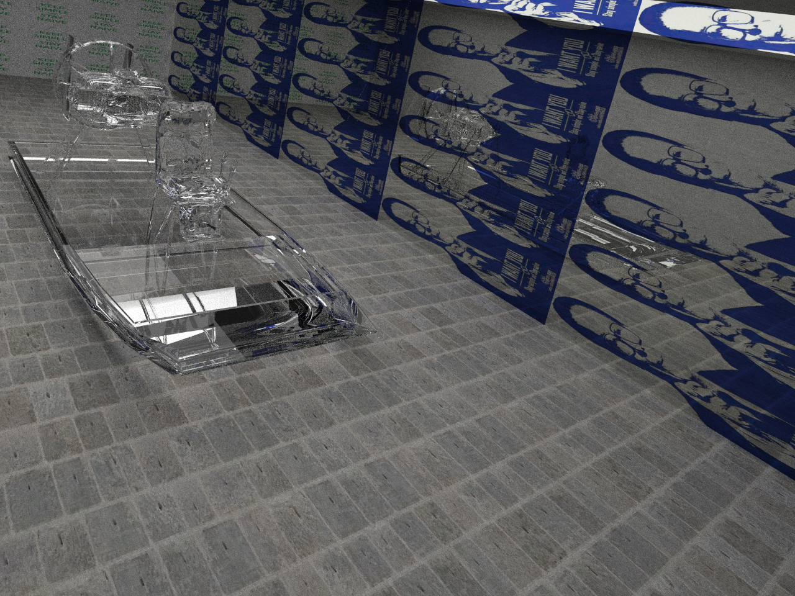
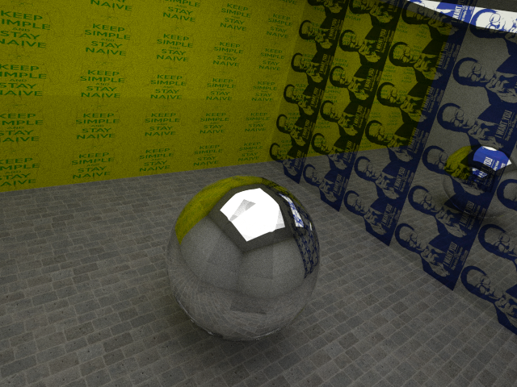

# Gallifrey
Course assignment(midterm) of CS230.

To implement <del>an efficient</del> Ray Tracing algorithm on CPU.

Default resolution is 640 x 480, if you would like to use other configurations, please refer to `src/image.h` and set the value of `height` and `width`.

## Structure

    demo/           # To store some selected outputs
    out/            # Output of the program will be directed here
    resources/      # To store `.obj` models
    vendor/         # To store third-party libraries
    src/            # Source code
    | aabb.h        # To implement the Axis-Aligned Bounding Box
    | colors.h      # To implement some functions related to color of pixels.
    | geometry.h    # To implement some classes and functions related to algebra and geometry.
    | image.h       # To implement a class that contains the information of the output.
    | io.h          # To implement some functions to parse `.obj` files and dump `.bmp` files.
    | kdtree.h      # To implement the SAH-KDTree
    | shader.h      # To implement the Phong Shading algorithm.
    | texture.h     # To implement some functions that deal with textures.
    | tracing.h     # To implement Local Illuminaion and MCPT.
    | main.cpp      # Set parameters

## Features

- Phong Shading
- Anti Aliasing
- Global / Local illumination
- Space Medium/SAH KD-Tree
- Multi Threading
- Monte Carlo Path Tracing
- Texture

## Requirements

- GCC/G++(mingw) 4.9+, std-c++11
- CMake 3.5+
- OpenCV 2.4+
- ConcurrentQueue(https://github.com/cameron314/concurrentqueue.git)
- Bitmap(https://github.com/ArashPartow/bitmap.git)
- Json(https://github.com/nlohmann/json.git)

## Compile & Run
This project is cross-platform (Windows, Unix/Linux). But it's not recommended to compile & run on Windows cause multi-threading is disabled, thus rendering may take a long time.

For Unix/Linux users:

    git clone https://github.com/yzh119/gallifrey.git --recurse-submodules
    cd gallifrey/
    cmake -DCMAKE_BUILD_TYPE=RELEASE .
    make && cd bin
    ./gallifrey --config CONFIG_NAME [--distance DISTANCE] [--sah ENABLE_SAH] [--core THREADS] [--samples SAMPLES] [--display] [--anti_aliasing] [--shadow] [--global] [--help]
    cd ../out

For Windows users, please use Powershell and make sure that `git`, `mingw`, `cmake` are all in your `PATH` environment variable):

The default `OPENCV` include path is `C:\opencv\install\include`, and the default library path is `C:\opencv\install\x86\mingw\lib`; you could set them as you like in `CMakeLists.txt`.

    git clone https://github.com/yzh119/gallifrey.git --recurse-submodules
    cd gallifrey/
    cmake -G "MinGW Makefiles" -DCMAKE_BUILD_TYPE=RELEASE .
    mingw32-make
    cd bin
    ./gallifrey --config CONFIG_NAME [--distance DISTANCE] [--sah ENABLE_SAH] [--core THREADS] [--samples SAMPLES] [--display] [--anti_aliasing] [--shadow] [--global] [--help]
    cd ../out

# Format(config.json)

    {
        "objects":
            [
                {                               // Model 1
                    "model":    modelname_1,
                    "scale":    scale,
                    "ka":       [r, g, b],      // ka, for Local illumination (0 <= r, g, b <= 1, similarly hereinafter)
                    "ks":       [r, g, b],      // ks, for Local illumination
                    "kd":       [r, g, b],      // kd, for Local illumination
                    "c":        [r, g, b],      // Color, for global illumination
                    "e":        [r, g, b],      // Emission, for global illumination
                    "refl":     refl            // "SPEC"/"DIFF"/"RERF", for global illumination
                },

                {                               // Model 2
                    "model":    modelname_2,
                    ...
                },

                ...
            ]
    }

# Notice

`--sah` is not recommended. **There are some bugs in my implementation of SAH KD-Tree, thus using space medium KDTree is far more faster.**

## Milestone
- [x] Surface Area Heuristic KD-Tree
- [x] Space Medium KD-Tree
- [x] Anti Aliasing
- [x] Phong Shader
- [x] Ray Casting (Local illumination)
- [x] Ray Tracing (Global illumination)
- [x] Soft Shadow
- [x] Transparent
- [x] Color Blending
- [x] Texture
- [x] Multi-threading
- [ ] Fix the bug in SAH KD-Tree
- [ ] Use OPENCL to replace multi threading.
- [x] <del>**Some errors in specular**</del>(You should only apply interpolation on the normal vector when the face is small).

## Statistics

- Environment: 
	- Aliyun Cloud HPC(G4): 64 core CPU.
- Nomenclature: 
	- li(Local Illumination)
	- gi(Global Illumination)
	- aa(Anti Aliasing)
	- ss(Soft Shadow)
	- sp(Samples)
	- n(#faces).

### Note: 

	time_render(aa) 	= 4 	* time_render(no-aa)			# Sample 4 times per pixel.
	time_render(spAAA) 	= AAA 	* time_render(sp1)			# Sample AAA times per pixel.
	time_render(ss)		= 27 	* log(n) * time_render(no-ss) 		# Illumination: 54/2(for soft shadow)
	time_build(n)		= O(n log^2 n)					# Recursively build the KD-Tree

instance(#faces)	| build-tree(s)		| Render(s)
--------------------|-------------------|----------------
horse-li(96k)		| 0.594				| 13.883
horse-li-aa(96k)	| 0.591				| 55.228
dinosaur-li(9k)		| 0.018				| 15.533				
teapot-li-ss-aa(3.7k)| 0.033			| 632.007
sphere-gi-sp200(0.1k)| 0.001			| 200.590
teapot-gi-sp500(3.7k)| 0.033			| 2394.832
sphere-gi-sp20(0.1k) | 0.001			| 15.938
airboat-gi-sp20(6k)	 | 0.029			| 83.761
dinosaur-gi-sp20(9k) | 0.018			| 58.081
cube-gi-sp100(6)	 | 0.000			| 27.100

## Demo

Local illumination.

Local illumination with soft shadow.

Gloal illumination(200 samples)

Gloal illumination(500 samples)

Global illumination(20 samples)

Global illumination(100 samples) + Anti Aliasing

## Reference
- An Integrated Introduction to Computer Graphics and Geometric Modeling. Ron Goldman
- Global Illumination in 99 lines of C++: http://www.kevinbeason.com/smallpt/
- SAH kd-tree: http://dcgi.felk.cvut.cz/home/havran/ARTICLES/ingo06rtKdtree.pdf
- About how to load textures: https://learnopengl-cn.readthedocs.io/zh/latest/01%20Getting%20started/06%20Textures/
- Ray-Box Intersection: http://www.cs.utah.edu/~awilliam/box/box.pdf
- Yuxin Wu's repository: https://github.com/ppwwyyxx/Ray-Tracing-Engine
